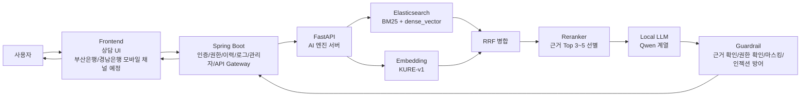
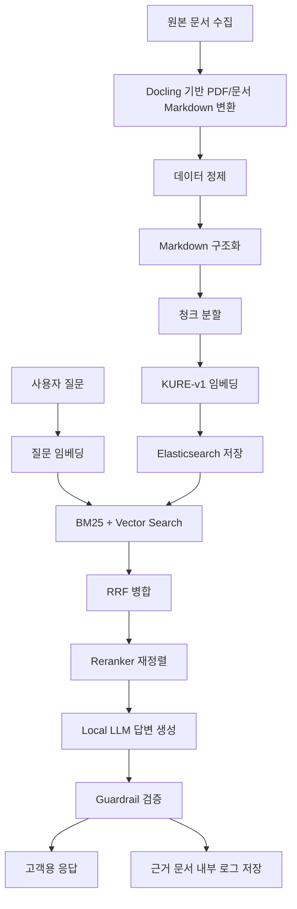

# BNK_Bot

BNK_Bot은 은행 업무 매뉴얼, FAQ, 상담 스크립트, 규정 문서 등 내부 문서를 기반으로 신뢰성 있는 상담 답변을 생성하는 **로컬 RAG 상담 챗봇** 프로젝트입니다.

이 프로젝트는 SQL 생성 챗봇이 아니라, 내부 문서를 검색하고 근거 문서에 기반해 상담 답변을 생성하는 AI 상담 시스템을 목표로 합니다. 외부 API에 의존하지 않는 Qwen 기반 로컬 LLM, KURE-v1 임베딩, Elasticsearch 기반 Hybrid Search, 권한 제어와 민감정보 마스킹을 포함한 보안 중심 구조를 설계합니다.

> 현재 레포지토리는 PDF 기반 문서 인입, Markdown 변환, 청크 생성, KURE-v1 임베딩, Elasticsearch 색인, BM25 + Vector Hybrid Search CLI까지 PoC 수준으로 구현되어 있습니다. Qwen 답변 생성, Spring Boot 연동, 고객용 UI는 아직 구현 전입니다.

## 문제 정의

기존 메뉴형 챗봇은 사용자가 원하는 업무 메뉴를 직접 찾아야 하며, 표현이 조금만 달라도 적절한 답변으로 이어지기 어렵습니다. 은행 업무는 규정, 상품, 채널, 고객 구분, 시행일에 따라 답변이 달라질 수 있어 단순 FAQ 매칭만으로는 정확한 상담 응답을 만들기 어렵습니다.

LLM을 그대로 사용하면 모델이 근거 없는 답변을 생성하는 환각 문제가 발생할 수 있고, 외부 API 기반 모델을 사용할 경우 내부 문서와 고객 정보가 외부로 전송될 수 있다는 보안 부담이 있습니다. BNK_Bot은 이러한 문제를 줄이기 위해 내부 문서를 모델에 외우게 하는 방식이 아니라, 질문 시점에 관련 문서를 검색하고 해당 근거 안에서만 답변하는 RAG 구조를 사용합니다.

## 핵심 기능

| 구분 | 설명 | 상태 |
| --- | --- | --- |
| 자연어 상담 질의 | 사용자가 메뉴 탐색 없이 자연어로 은행 업무를 질문 | 설계 |
| 내부 문서 기반 RAG 검색 | 매뉴얼, FAQ, 상담 스크립트, 규정 문서를 검색해 답변 근거로 사용 | PoC 구현 |
| Elasticsearch Hybrid Search | BM25 키워드 검색과 Dense Vector Search를 함께 사용 | PoC 구현 |
| 근거 기반 답변 생성 | 검색된 문서 조각을 기반으로 로컬 LLM이 답변 생성 | 설계 |
| 근거 부족 시 답변 거절 | 충분한 근거가 없으면 추측하지 않고 답변 제한 | 설계 |
| 근거 문서 로그 저장 | 고객에게 출처를 직접 노출하지 않고, 답변에 사용된 근거 문서를 내부 로그로 저장 | 설계 |
| 권한 기반 문서 접근 제어 | 사용자 권한에 따라 검색 가능 문서 필터링 | 설계 |
| 상담 로그 저장 | 질의, 검색 결과, 답변, 거절 사유 등을 감사 가능한 형태로 저장 | 설계 |
| 민감정보 마스킹 | 고객정보, 계좌번호, 연락처 등 민감정보 노출 방지 | 설계 |

## 전체 아키텍처



## 기술 스택

| 영역 | 기술 | 비고 |
| --- | --- | --- |
| Frontend | React 또는 Vue | 현재 구현 전, 추후 부산은행/경남은행 모바일 채널 연동 고려 |
| Backend | Spring Boot | 1차 구현 목표, 인증, 권한, 상담 이력, 로그, 관리자 기능, FastAPI 호출 |
| AI Server | Python CLI / FastAPI 예정 | 현재는 RAG 인입/검색 CLI 구현, FastAPI 서버는 예정 |
| Search Engine | Elasticsearch | BM25, dense_vector, 권한 필터링 |
| Embedding | `nlpai-lab/KURE-v1` | 한국어 업무 문서용 임베딩 모델로 확정 |
| LLM | Qwen 계열 로컬 모델 | 내부망 또는 로컬 환경 실행 |
| Vector Search | Elasticsearch `dense_vector` | 벡터 기반 의미 검색 |
| Reranker | BGE/Qwen 계열 reranker 후보 | 최종 근거 Top 3~5 선별, 현재 구현 전 |
| Data Format | Markdown 기반 문서 | Docling으로 PDF를 Markdown으로 변환한 뒤 청킹 |

## RAG 파이프라인



1. 원본 문서를 수집하고 Docling을 사용해 PDF 등 문서 형식을 Markdown 중심 구조로 변환합니다.
2. 반복 헤더/푸터, 표 구조, 폐기 문서 등을 정제합니다.
3. 문서명, 업무영역, 고객구분, 채널, 버전, 시행일, 권한 메타데이터를 부여합니다.
4. 검색에 적합한 크기로 청크를 분할하고 임베딩을 생성합니다.
5. Elasticsearch에 BM25 검색용 텍스트와 Dense Vector Search용 벡터를 함께 저장합니다.
6. 사용자 질문에 대해 BM25와 Vector Search를 수행하고 RRF로 병합합니다.
7. 현재 PoC는 RRF 병합 결과를 검색 결과로 출력합니다.
8. 이후 단계에서 Reranker와 Local LLM을 연결해 근거 기반 답변을 생성합니다.

## 데이터 품질 관리

임베딩 품질은 원본 문서 품질에 크게 의존합니다. BNK_Bot은 임베딩 이전 단계에서 다음 기준으로 데이터를 정리하는 것을 목표로 합니다.

| 관리 항목 | 설명 |
| --- | --- |
| 최신/폐기 문서 구분 | 시행 중인 문서와 폐기 문서를 분리하고 검색 대상에서 폐기 문서를 제외 |
| PDF/문서 추출 오류 정제 | 깨진 문자, 잘못된 줄바꿈, 페이지 번호 혼입 등을 수정 |
| 반복 헤더/푸터 제거 | 모든 페이지에 반복되는 제목, 보안 문구, 페이지 번호 제거 |
| 표의 문장형 변환 | 상품 조건, 수수료, 절차 표를 검색 가능한 자연어 문장으로 변환 |
| 업무 용어/동의어 정리 | 은행 내부 용어, 약어, 고객 표현을 매핑 |
| 메타데이터 부여 | 문서명, 업무영역, 고객구분, 채널, 버전, 시행일, 권한 정보 저장 |
| 중복 문서 제거 | 동일하거나 거의 같은 문서가 반복 검색되지 않도록 정리 |
| 충돌 문서 정리 | 서로 다른 기준을 말하는 문서의 버전, 시행일, 우선순위 확인 |
| 민감정보 마스킹 | 고객정보, 계좌번호, 연락처, 식별자 등을 비식별화 |
| 테스트셋 구축 | 테스트 질문과 정답 문서를 매핑해 검색 품질 평가에 사용 |

## 검색 전략

BNK_Bot은 단일 검색 방식에 의존하지 않고 BM25, Dense Vector Search, RRF, Reranker를 조합하는 Hybrid Search 구조를 지향합니다.

| 구성요소 | 역할 |
| --- | --- |
| BM25 | 정확한 키워드, 업무 용어, 상품명, 문서명, 조항명 검색에 강점 |
| Dense Vector Search | 사용자가 문서와 다른 표현으로 질문해도 의미적으로 가까운 문서를 검색 |
| RRF | BM25 결과와 Vector 결과를 순위 기반으로 병합해 편향을 줄임 |
| Reranker | 후보 문서 중 실제 질문에 가장 적합한 최종 근거 Top 3~5 선별 |

## 임베딩 모델

BNK_Bot의 임베딩 모델은 `nlpai-lab/KURE-v1`을 기준 모델로 확정합니다. 한국어 은행 매뉴얼, 규정, 절차 문서 중심의 검색 품질을 우선하며, 모델 교체보다는 데이터 정제, 청킹 전략, 검색 파라미터, Reranker 적용을 통해 검색 품질을 개선합니다.

| 모델 | 적용 기준 |
| --- | --- |
| `nlpai-lab/KURE-v1` | 한국어 은행 업무 매뉴얼, 규정, 절차 문서 검색용 임베딩 모델로 사용 |

검색 품질은 내부 테스트셋을 기반으로 지속 검증합니다. 주요 지표는 `Recall@3`, `Recall@5`, `MRR`, Top-k 근거 정확도, 오검색률입니다.

## 환각 방지 정책

BNK_Bot은 답변 생성보다 근거 검증을 우선합니다.

- 검색된 근거 문서 안에서만 답변합니다.
- 근거 문서가 부족하거나 신뢰도가 낮으면 답변을 거절합니다.
- 고객에게 출처 문서를 직접 노출하지 않고, 답변 생성에 사용된 근거 문서는 내부 로그로만 저장합니다.
- 추측성 답변, 일반 상식 기반 보완 답변을 제한합니다.
- 사용자 권한이 없는 문서를 기반으로 답변하지 않습니다.
- 내부 문서 원문을 과도하게 노출하지 않고 필요한 범위만 요약합니다.
- 프롬프트 인젝션으로 시스템 규칙이나 내부 정책을 우회하려는 입력을 차단합니다.

## 보안 설계

| 보안 항목 | 설계 방향 |
| --- | --- |
| 로컬/내부망 실행 | 외부 API 호출 없이 내부망 또는 로컬 환경에서 LLM, 임베딩, 검색 엔진 실행 |
| 권한 기반 접근 제어 | 사용자 역할, 부서, 업무 권한에 따라 검색 대상 문서를 필터링 |
| 상담 로그 저장 | 질의, 검색 문서, 답변, 거절 사유, 사용자 식별자 등을 보안 정책에 따라 저장 |
| 민감정보 마스킹 | 고객명, 계좌번호, 주민등록번호, 전화번호 등 민감정보를 마스킹 |
| 프롬프트 인젝션 방어 | 내부 규칙 무시, 문서 원문 대량 출력, 권한 우회 요청 등을 탐지하고 차단 |
| 비밀정보 노출 금지 | API Key, 개인정보, 내부망 주소, 계정 정보, 운영 데이터는 레포에 포함하지 않음 |
| 검색 결과 필터링 | LLM 전달 전 검색 결과도 사용자 권한 기준으로 필터링 |

## 프로젝트 구조

현재 레포지토리는 아래와 같은 PoC 구조를 포함합니다.

```text
BNK_Bot/
├── .env.example
├── docker-compose.yml
├── ai-server/
│   ├── app/
│   │   └── config.py
│   ├── rag/
│   │   ├── pdf_to_markdown.py
│   │   ├── chunker.py
│   │   ├── embedder.py
│   │   ├── elastic_index.py
│   │   ├── hybrid_search.py
│   │   └── rrf.py
│   ├── scripts/
│   │   ├── ingest_pdfs.py
│   │   └── search.py
│   └── requirements.txt
├── data/
│   ├── raw_pdfs/
│   ├── markdown/
│   ├── chunks/
│   └── samples/       # 예정
├── models/
│   └── KURE-v1/       # 로컬 다운로드 시 사용, Git 제외
└── README.md
```

주요 디렉터리와 파일 역할은 다음과 같습니다.

| 경로 | 역할 |
| --- | --- |
| `docker-compose.yml` | 로컬 Elasticsearch 실행 |
| `.env.example` | Elasticsearch 주소, 인덱스명, 모델 경로, 청크 설정 예시 |
| `ai-server/app/config.py` | 환경변수와 기본 설정 로딩 |
| `ai-server/scripts/ingest_pdfs.py` | PDF → Docling Markdown → Chunk → KURE 임베딩 → Elasticsearch 색인 실행 |
| `ai-server/scripts/search.py` | 질문을 받아 BM25 + Vector Search + RRF 결과 출력 |
| `ai-server/` | 현재는 RAG CLI PoC, 추후 FastAPI 기반 AI 서버로 확장 |
| `ai-server/rag/` | 문서 검색, RRF 병합, RAG 오케스트레이션 |
| `data/raw_pdfs/` | 사용자가 샘플 PDF를 넣는 입력 디렉터리, Git 제외 |
| `data/markdown/` | PDF에서 변환된 Markdown 출력, Git 제외 |
| `data/chunks/` | 청크 JSONL 출력, Git 제외 |
| `models/KURE-v1/` | KURE-v1 모델 로컬 저장 위치, Git 제외 |

## 실행 방법

현재 구현된 범위는 로컬 CLI 기반 RAG 검색 PoC입니다.

### 1. Python 환경 준비

Docling 사용을 위해 Python 3.10 이상을 권장합니다.

```bash
python3.11 -m venv ai-server/venv
source ai-server/venv/bin/activate
pip install -r ai-server/requirements.txt
```

### 2. Elasticsearch 실행

```bash
docker compose up -d
```

### 3. KURE-v1 모델 다운로드

인터넷이 가능한 환경에서는 아래 명령으로 모델을 로컬에 저장합니다.

```bash
huggingface-cli download nlpai-lab/KURE-v1 --local-dir models/KURE-v1
```

모델을 미리 다운로드하지 않아도 `SentenceTransformer`가 최초 실행 시 Hugging Face에서 자동 다운로드를 시도합니다. 내부망/오프라인 환경에서는 `models/KURE-v1/`에 모델 파일을 옮긴 뒤 실행합니다.

### 4. PDF 배치

샘플 PDF를 아래 디렉터리에 넣습니다.

```text
data/raw_pdfs/
```

### 5. PDF 인입과 색인

```bash
cd ai-server
python scripts/ingest_pdfs.py --recreate-index
```

이 명령은 Docling으로 PDF를 Markdown으로 변환하고, 청크를 만든 뒤, KURE-v1 임베딩을 생성해 Elasticsearch에 저장합니다.

### 6. Hybrid Search 실행

```bash
cd ai-server
python scripts/search.py "한도제한계좌 해제 조건이 뭐야?"
```

검색 결과는 고객에게 직접 노출하는 답변이 아니라 개발/검증용 결과입니다. `chunk_id`, `doc_id`, `title`, `section`, `source_file`, 점수, 본문 미리보기를 출력합니다.

### Spring Boot 서버 예정

```bash
cd backend-spring
./gradlew bootRun
```

### Frontend 예정

```bash
cd frontend
npm install
npm run dev
```

## 개발 로드맵

현재 1차 목표는 문서 기반 RAG PoC부터 Spring Boot 연동까지입니다. 상담 UI와 부산은행/경남은행 모바일 채널 연동은 이후 단계에서 검토합니다.

| 단계 | 내용 | 상태 |
| --- | --- | --- |
| 1단계 | 문서 정리 및 Markdown 변환 | PoC 구현 |
| 2단계 | KURE-v1 기반 임베딩 테스트 | PoC 구현 |
| 3단계 | Elasticsearch 기반 검색 PoC 검증 | PoC 구현 |
| 4단계 | Elasticsearch Hybrid Search 적용 | PoC 구현 |
| 5단계 | Reranker 적용 | 예정 |
| 6단계 | FastAPI AI 서버 구축 | 예정 |
| 7단계 | Spring Boot 연동 | 예정 |
| 8단계 | Guardrail 및 보안 정책 적용 | 예정 |
| 9단계 | 상담 UI 구현 | 예정 |
| 10단계 | 부산은행/경남은행 모바일 채널 연동 검토 | 예정 |
| 11단계 | LoRA 기반 상담 말투 개선 검토 | 검토 |

## 평가 지표

### 검색 품질 평가

| 지표 | 설명 |
| --- | --- |
| Recall@3 | 정답 문서가 검색 결과 상위 3개 안에 포함되는 비율 |
| Recall@5 | 정답 문서가 검색 결과 상위 5개 안에 포함되는 비율 |
| MRR | 정답 문서가 몇 번째 순위에 등장하는지 평가 |
| Top-k 근거 정확도 | LLM에 전달된 근거 문서가 실제 답변에 적합한지 평가 |
| 오검색률 | 관련 없는 문서가 높은 순위로 검색되는 비율 |

### 답변 품질 평가

| 지표 | 설명 |
| --- | --- |
| 근거 일치율 | 답변 내용이 제공된 근거 문서와 일치하는 비율 |
| 환각 발생률 | 근거에 없는 내용을 답변한 비율 |
| 근거 로그 정확도 | 내부 로그에 저장된 근거 문서가 실제 답변 생성 근거와 일치하는지 평가 |
| 상담 응답 만족도 | 내부 평가자 또는 테스트 사용자의 상담 품질 평가 |

## 주의사항

- 이 레포지토리에는 실제 은행 고객정보나 내부 문서를 포함하지 않습니다.
- 샘플 데이터는 비식별화된 예시 문서만 사용합니다.
- 실제 운영 환경에서는 별도의 권한 제어, 로그 보관 정책, 개인정보 영향 검토, 보안성 검토가 필요합니다.
- API Key, 계정 정보, 내부망 주소, 실제 운영 데이터는 커밋하지 않습니다.
- 공개 레포 기준 문서화에서는 내부 정책 문서 원문이나 민감한 업무 절차를 노출하지 않습니다.
