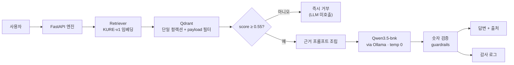
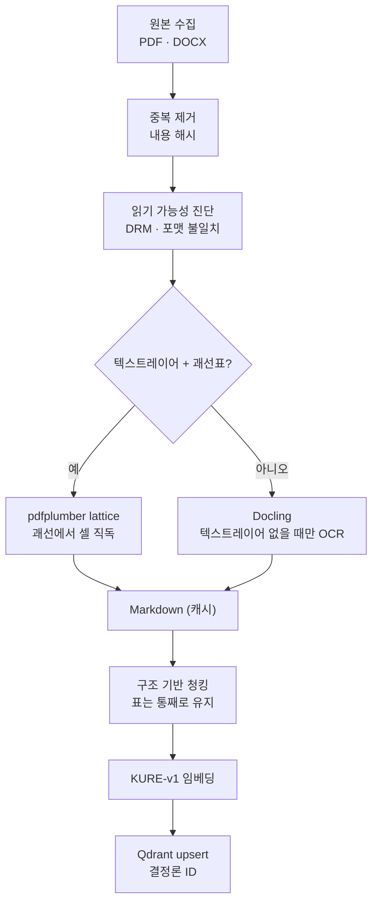

# BNK_Bot

부산은행(BNK) 금융상품 문서(상품설명서·약관·특약·신탁계약서)를 적재해, **근거 문서 안에서만**
답하는 **로컬 RAG 상담 챗봇 엔진**입니다. 외부 API를 쓰지 않고 임베딩·LLM·벡터DB를 전부
로컬에서 실행합니다.

핵심 원칙은 하나입니다 — **정확한 정보를 주거나, 모르면 모른다고 답한다.**
그 사이의 그럴듯한 추측이 가장 나쁜 실패라고 보고, 이를 프롬프트 지시가 아니라
**코드 통제**로 강제합니다.

> 이 문서는 **현재 구현된 것**을 기준으로 합니다. 설계 단계에서 계획했으나 아직 만들지 않은
> 항목은 [보완할 점](#보완할-점) 절에 따로 모았습니다.

---

## 현재 상태

| 항목 | 값 |
| --- | --- |
| 코퍼스 | 2,691청크 / 192문서 / 139상품 (예금 전량 + 펀드 일부) |
| 답변 정확도 | **33/33 (100%)** · 답변 28/28 · 거부 5/5 · held-out 14/14 |
| 숫자 위반 / 가드레일 오차단 | **0 / 0** |
| 검색 품질 | **pass@1 93% · pass@5 100%** |
| 청킹 글자 보존 | **223/223** |
| 장애 경로 | **10/10** |
| 응답 지연 | 도메인 밖 거부 **0.0초**(LLM 미호출) · 일반 답변 5~25초(로컬 9B) |

모든 수치는 저장소 안의 스크립트로 재생성할 수 있고, `temperature=0` 이라 **재실행해도 같은
값**이 나옵니다.

⚠️ 평가셋은 **33문항 자가채점**입니다. 회귀 확인용 게이트이지 gold benchmark 가 아닙니다.
인용 시 문항 수와 자가 라벨이라는 조건을 함께 밝혀야 합니다.

---

## 요구사항

| 항목 | 내용 |
| --- | --- |
| Python | 3.11+ |
| Docker | Qdrant 실행용 |
| Ollama | 로컬 LLM 실행 (공식 앱/dmg 권장 — `brew install ollama` 는 `llama-server` 누락으로 실행 실패) |
| 디스크 | 모델 ~7GB(KURE 2GB + Qwen 9B) + 벡터DB(코퍼스 규모에 비례) |
| 메모리 | 16GB 이상 권장. 적재 시 KURE+Docling 이 동시에 올라가므로 여유가 없으면 스와핑으로 매우 느려짐 |

원본 문서(PDF/DOCX)는 저장소에 포함되지 않습니다. 별도로 전달받아 배치해야 합니다.

---

## 설치와 실행

### 1. 의존성

```bash
python -m venv .venv
source .venv/bin/activate
pip install -r requirements.txt
```

### 2. 원본 문서 배치

폴더 구조가 곧 메타데이터입니다. **`{카테고리}/{문서종류}/파일.pdf`** 형태로 두면
`category`·`doc_type` 이 자동으로 붙습니다.

```text
Data_PDF/
├── 예금/
│   ├── 설명서/*.pdf
│   └── 약관/*.pdf
└── 펀드/
    └── 약관/*.pdf
```

기본 위치는 **프로젝트 옆 `../Data_PDF`** 입니다. 다른 곳에 두려면 아래 `.env` 로 지정합니다.

### 3. 환경변수 (`.env`)

프로젝트 루트에 `.env` 를 만듭니다. 모든 항목에 코드 기본값이 있어 **`.env` 없이도 엔진은
뜨고 질의응답은 됩니다**(색인이 이미 있고 Qdrant·Ollama 가 기본 포트에 있을 때).

다만 **적재는 `DATA_ROOT` 가 실제 원본 위치와 맞아야** 합니다. 기본값은
`<프로젝트>/../Data_PDF` 이고, 그 경로가 없으면 적재 요청이 **400 으로 거부**됩니다
(예전엔 0건 적재하고 조용히 성공했습니다). 문서를 다른 곳에 두셨다면 반드시 지정하세요.

```bash
# ── 원본 문서 경로 ─────────────────────────────────────────
# DATA_ROOT: 원본 루트이자 적재가 닿을 수 있는 경로의 상한(보안 경계).
#            /admin/ingest 의 root 는 반드시 이 아래여야 한다.
#            미지정 시 기본값 = <프로젝트>/../Data_PDF
DATA_ROOT=/absolute/path/to/Data_PDF

# RAW_DIR: 기본 적재 대상. 미지정 시 DATA_ROOT 전체.
#          일부만 적재하려면 하위 경로를 지정 (DATA_ROOT 안이어야 함)
# RAW_DIR=/absolute/path/to/Data_PDF/예금

# ── Qdrant ────────────────────────────────────────────────
QDRANT_URL=http://localhost:6333
QDRANT_API_KEY=
QDRANT_COLLECTION_NAME=bnk_bot_collection

# ── LLM (Ollama 의 OpenAI 호환 엔드포인트) ─────────────────
LLM_BASE_URL=http://localhost:11434/v1
LLM_API_KEY=ollama          # Ollama 는 키를 검증하지 않음(SDK 가 빈 키를 거부해서 채우는 더미)
LLM_MODEL=qwen3.5-bnk
LLM_TIMEOUT_S=120

# ── 정확성 통제 ────────────────────────────────────────────
# 검색 채택 하한(cosine). 이 아래 점수는 '근거 없음'으로 보고 버린다.
# ⚠️ 코퍼스가 크게 바뀌면 scripts/measure_score_threshold.py 로 재보정할 것
RETRIEVAL_SCORE_THRESHOLD=0.55

# 답변 숫자가 근거에 없을 때 답변을 폐기하고 "모름"으로 돌릴지
GUARDRAIL_BLOCK_ON_NUMBER_VIOLATION=true
```

### 4. Qdrant 기동 (필수)

엔진은 부팅 시 Qdrant 에 연결하므로 **먼저 떠 있어야** 합니다.

```bash
docker compose up -d
curl localhost:6333/collections     # 확인
```

### 5. LLM 준비

```bash
ollama pull qwen3.5:9b
ollama create qwen3.5-bnk -f Modelfile   # num_ctx 16384 파생 모델
ollama list                               # qwen3.5-bnk 확인
```

`num_ctx` 를 키운 이유: 큰 표 근거가 기본 창(4096)을 넘어 **답변이 비어 나오는** 문제가 있었고,
OpenAI 호환 엔드포인트는 `num_ctx` 를 요청 파라미터로 받지 않아 모델 쪽에 고정해야 합니다.

### 6. 적재

**CLI (권장 — 장시간 배치)**

```bash
python scripts/run_ingestion.py                    # DATA_ROOT 전체
python scripts/run_ingestion.py <경로> --limit 10   # 일부만(스모크)
python scripts/run_ingestion.py --recreate         # 컬렉션 비우고 재생성
```

**API (관리자)**

```bash
curl -X POST localhost:8000/admin/ingest \
  -H 'Content-Type: application/json' -d '{"limit": 2}'
# → 202 {job_id}
curl localhost:8000/admin/ingest/{job_id}          # 상태 조회
```

적재는 **idempotent** 합니다(파일명+청크번호로 ID 를 만들어 덮어씀). 중단해도 같은 명령으로
이어서 하면 되고, 파싱 결과(MD)는 캐시되어 재적재가 빠릅니다.

### 7. 엔진 실행

```bash
uvicorn src.main:app --port 8000
```

첫 부팅에 ~15초(KURE 로딩). Swagger: `localhost:8000/docs`

```bash
curl localhost:8000/health
curl -X POST localhost:8000/query \
  -H 'Content-Type: application/json' \
  -d '{"question":"동백통장 기본이율이 얼마야?","top_k":3}'
```

---

## API

### `POST /query` — 고객 질의

```jsonc
// 요청
{ "question": "동백통장 기본이율이 얼마야?", "top_k": 5,
  "category": null, "product": null, "doc_type": null }   // 선택 필터

// 응답
{
  "answer": "기본이율은 연 0.01%입니다.",
  "grounded": true,          // 숫자 검증 통과 여부
  "violations": [],          // 근거에 없던 수치
  "used_chunks": 3,
  "sources": [{
    "product_name": "동백통장", "doc_type": "설명서",
    "source_file": "동백통장_상품설명서(2025.11.01)",   // 판본 식별용
    "page": 1, "section": "", "snippet": "...", "score": 0.717
  }]
}
```

- `503` — LLM 다운/타임아웃 (스택 노출 없이 안내 문구)
- `422` — 빈 질문

### `GET /health` — readiness

Qdrant 연결과 포인트 수를 확인합니다. Qdrant 다운이면 **503**, 포인트 0이면 `200 "degraded"`.

### `POST /admin/ingest` — 관리자 적재

`{ "root": "<DATA_ROOT 하위 경로>", "limit": N }` — 둘 다 선택. 비동기(202 + job_id), **동시 1개**.

- `400` — root 가 `DATA_ROOT` 밖
- `409` — 이미 적재 중
- ⚠️ **`recreate` 파라미터는 없습니다.** 컬렉션 삭제는 CLI 전용입니다 — 무인증 상태에서
  요청 한 번에 전량이 소실되는 것을 막기 위해서입니다. 보내면 422 로 거절합니다.

---

## 아키텍처


```mermaid
flowchart LR
    U["사용자"] --> API["FastAPI 엔진"]
    API --> RET["Retriever<br/>KURE-v1 임베딩"]
    RET --> QD["Qdrant<br/>단일 컬렉션 + payload 필터"]
    QD --> TH{"score ≥ 0.55?"}
    TH -- "아니오" --> REF["즉시 거부<br/>(LLM 미호출)"]
    TH -- "예" --> PR["근거 프롬프트 조립"]
    PR --> LLM["Qwen3.5-bnk<br/>via Ollama · temp 0"]
    LLM --> GR["숫자 검증<br/>guardrails"]
    GR --> RES["답변 + 출처"]
    GR --> AUD["감사 로그"]
```

도메인은 둘로 나뉩니다 — `ingestion`(적재)과 `chat`(질의응답). 의존 방향은 한쪽으로만
흐릅니다(chat → ingestion 의 공유 인프라).

```text
src/
├── main.py              FastAPI 진입점 · lifespan 싱글톤 · /health
├── chat/
│   ├── router.py        POST /query (얇은 컨트롤러)
│   ├── service.py       RAG 오케스트레이션 + 가드레일
│   ├── retriever.py     질문 → 임베딩 → Qdrant top-k (score 하한 적용)
│   ├── generator.py     Ollama(OpenAI 호환) 어댑터 · temperature 0
│   ├── guardrails.py    답변 숫자가 근거에 실재하는지 프로그램 검증
│   ├── audit.py         질의 감사 기록(형식은 교체 가능하게 분리)
│   └── schemas.py       DTO
└── ingestion/
    ├── parser.py        원본 → Markdown (라우팅 + DRM 진단)
    ├── table_extractor.py  괘선 기반 표 복원
    ├── processor.py     구조 기반 청킹
    ├── embedder.py      KURE-v1 임베딩
    ├── qdrant.py        벡터 저장/검색
    ├── pipeline.py      end-to-end 오케스트레이션
    ├── jobs.py          비동기 적재 job + 경로 경계
    └── router.py        POST /admin/ingest
```

---

## 적재 파이프라인


```mermaid
flowchart TD
    A["원본 수집<br/>PDF · DOCX"] --> B["중복 제거<br/>내용 해시"]
    B --> C["읽기 가능성 진단<br/>DRM · 포맷 불일치"]
    C --> D{"텍스트레이어 + 괘선표?"}
    D -- "예" --> E["pdfplumber lattice<br/>괘선에서 셀 직독"]
    D -- "아니오" --> F["Docling<br/>텍스트레이어 없을 때만 OCR"]
    E --> G["Markdown (캐시)"]
    F --> G
    G --> H["구조 기반 청킹<br/>표는 통째로 유지"]
    H --> I["KURE-v1 임베딩"]
    I --> J["Qdrant upsert<br/>결정론 ID"]
```

**표는 Docling 이 아니라 pdfplumber 로 복원합니다.** BNK 문서는 born-digital 이고 표마다
괘선(벡터 라인)이 있는데, 비전 기반 TableFormer 는 이 선을 쓰지 못하고 병합셀·중첩표에서
무너집니다(중도해지표의 기간↔이율 오정렬 등 — 금융 문서에서 치명적). 괘선을 직접 읽는
lattice 방식이 결정론적으로 정확합니다. Docling 은 **버리지 않고 범용 폴백으로 유지**해
입력 커버리지를 지킵니다.

**청크 구조** — 각 청크는 두 벌의 텍스트를 갖습니다.

```text
text (임베딩 대상)   [동백통장_상품설명서(2025.11.01)] · 예금/설명서
                     | 가입금액 | ▣ 제한없음 |

body (LLM 근거)      | 가입금액 | ▣ 제한없음 |
```

`| 가입금액 | 제한없음 |` 만으로는 어느 상품인지 벡터에 담기지 않아 컨텍스트 한 줄을 붙입니다.
실측으로 확인했습니다 — 헤더를 떼면 pass@1 이 14/15 → 10/15 로 떨어집니다.
LLM 에게는 헤더 없이 **원문 그대로** 줍니다(수치가 바뀔 여지를 만들지 않기 위해).

---

## 정확성 통제

프롬프트 지시는 **보증이 아닙니다** — 모델이 지키면 지켜지고 아니면 아닙니다. 그래서 통제를
세 지점에 겁니다. **셋 다 LLM 의 협조가 필요 없습니다.**

| 지점 | 통제 | 효과 |
| --- | --- | --- |
| 입력 | 검색 score 하한(0.55) | 무관 질문이 LLM 에 닿기 전에 거부. 도메인 밖 질문 **0.0초** 응답 |
| 출력 | 숫자 프로그램 검증 | 답변의 수치가 근거·질문에 실재하지 않으면 답변 폐기 → "모름" |
| 생성 | `temperature=0` | 같은 질문에 같은 답. 재현·감사·회귀측정의 전제 |

`temperature` 를 0으로 고정한 근거: 0.2 에서 같은 질문·같은 근거로 5회 돌리자 답이 **세 갈래로
갈렸고 그중 2회가 오답**이었습니다(개별 항목의 최댓값을 전체 최댓값으로 오인). 그 값이 근거에
실재하는 숫자라 **숫자 가드레일도 통과**했습니다. 0.0 에서는 5/5 동일·정답이었습니다.

### 이 통제가 못 잡는 것 (정직한 한계)

- **mis-selection** — 근거에 40%와 80%가 다 있을 때 틀린 쪽을 고르는 것. 표에서 행을 잘못 읽는
  오류가 이 유형이고, 금융 문서에서 가장 흔합니다. 위 temperature 사례가 실제 관측 사례입니다.
- **서술형 뒤집힘** — "양도 불가" → "양도 가능". 숫자가 없어 검사에 걸리지 않습니다.

→ 이 둘은 통제가 아니라 **검색 정밀도와 평가셋**으로 관리합니다. 통제를 통과했다고 "정확성
확보"라고 결론지으면 안 됩니다.

---

## 검증 도구

전부 read-only 이고 종료코드로 성공/실패를 알립니다.

```bash
python scripts/eval_retrieval.py            # 검색 품질 pass@1/@5
python scripts/eval_answer.py               # 답변 품질(정확도·거부·숫자·held-out)
python scripts/check_chunk_conservation.py  # 청킹 글자 보존(NFC 기준)
python scripts/check_failure_paths.py       # 장애 경로(LLM/Qdrant 다운, 감사로그)
python scripts/check_product_names.py       # 상품명 검수
python scripts/measure_score_threshold.py   # 검색 임계 보정 — 대량 적재 후 필수
python scripts/ab_context_header.py         # 컨텍스트 헤더 A/B/C 실험
```

적재·청킹·프롬프트를 건드렸으면 최소 앞의 세 개는 돌려 회귀를 확인합니다.

---

## 보완할 점

초기 설계(2025-05)에서 계획했으나 **아직 구현되지 않은** 항목입니다. 일부는 측정 결과에 따라
의도적으로 다르게 간 것이고, 나머지는 납품처 규격이 정해져야 확정할 수 있는 것들입니다.

### 검색

| 항목 | 계획 | 현재 | 비고 |
| --- | --- | --- | --- |
| Hybrid Search (BM25 + Dense) | Elasticsearch 기반 | **Dense only** (Qdrant) | 상품명·조항명 같은 정확 키워드 검색에 약점. 유일한 검색 미스가 교차상품 일반질문이었음 |
| RRF 병합 | BM25/Vector 순위 병합 | 없음 | Hybrid 도입 시 함께 |
| Reranker | Top 3~5 재정렬 | 없음 | 현재는 top-k 를 그대로 사용 |
| 검색 지표 | Recall@3/@5, MRR | pass@1/@5 | 지표 체계가 다름. 정식 평가셋 구축 시 정렬 필요 |

### 보안·운영

| 항목 | 계획 | 현재 | 비고 |
| --- | --- | --- | --- |
| 권한 기반 접근 제어 | 역할·부서별 문서 필터링 | 없음 | payload 필터 구조는 있어 확장 가능 |
| 민감정보 마스킹 | 계좌번호·연락처 등 비식별화 | 없음 | 현 코퍼스는 상품 문서라 고객정보 없음 |
| 프롬프트 인젝션 방어 | 규칙 우회 탐지·차단 | 없음 | 근거 강제와 임계가 간접적으로 완화하나 명시적 방어는 아님 |
| `/admin/ingest` 인증 | 토큰 검증 | **없음** | 파괴적 파라미터만 차단. 인증 방식은 납품처 규격 종속 |
| 감사 로그 규격 | 보안 정책에 따른 저장 | JSONL 최소 기록 | 무엇을 남길지는 정함. 형식·보존기간은 미확정(`audit.py` 만 교체하면 됨) |

### 연동·UI

| 항목 | 계획 | 현재 | 비고 |
| --- | --- | --- | --- |
| Spring Boot 연동 | 인증·이력·API Gateway | 없음 | **의도적 보류** — API 계약이 납품처 규격에 종속 |
| Frontend 상담 UI | React/Vue | 없음 | |
| 멀티턴 대화 | 후속질문 처리 | 없음 | 대화 이력 보관 주체가 규격에 따라 갈림 |
| 응답 스트리밍 | | 없음 | |

### 데이터 처리 — 의도적으로 다르게 간 것

| 항목 | 계획 | 현재 | 이유 |
| --- | --- | --- | --- |
| 표의 문장형 변환 | 표를 자연어 문장으로 | **표를 markdown 그대로 유지** | 변환은 수치가 조용히 바뀔 위험이 있음. 표를 통째로 주고 LLM 이 행을 읽게 하는 편이 안전 |
| 최신/폐기 문서 구분 | 폐기 문서를 검색에서 제외 | **판단하지 않고 전부 색인** | 파일명 라벨은 사실이 아니고, 문서에 시행일이 없는 경우가 많음. 대신 `source_file` 을 응답에 노출해 판단을 상위로 넘김 |
| 고객에게 출처 미노출 | 근거는 내부 로그에만 | **응답에 sources 포함** | 검증 가능성을 우선. 고객 노출 여부는 상위(UI/Spring)에서 결정 |
| 메타데이터 | 업무영역·고객구분·채널·버전·시행일·권한 | category·doc_type·product_name·page·section | 폴더 구조에서 얻을 수 있는 것만. 나머지는 원본에 없음 |

### 데이터 정제 — 미구현

반복 헤더/푸터 제거, 업무 용어·동의어 매핑, 충돌 문서 정리는 아직 없습니다. 중복 문서 제거는
**내용 해시 기준으로 구현**되어 있습니다(실측 490 → 306건).

---

## 알려진 제약

- **평가셋이 소규모 자가채점(33문항)** 입니다. 회귀 게이트이지 gold benchmark 가 아닙니다.
- **lattice 표 복원의 후처리 휴리스틱은 BNK 문서로만 검증**되었습니다. 다른 기관 문서에서는
  미검증이며, 괘선이 없으면 Docling 으로 폴백하므로 크래시 없이 동작은 합니다.
- **OCR 판정이 문서 단위**입니다. 대부분 디지털인 문서에 스캔 페이지가 섞이면 그 페이지의
  글자를 얻지 못합니다(현 코퍼스에서는 미발생).
- **DRM 보호 문서는 처리할 수 없습니다.** 원인을 진단해 리포트에 남깁니다(현재 1건).
- **검색 임계 0.55 는 30개 질문 표본으로 보정한 값**입니다. 코퍼스가 크게 바뀌면 재보정이
  필요합니다.
- **macOS 파일명은 NFD** 입니다. 파일시스템에서 온 문자열과 코드 리터럴을 비교할 때 양쪽을
  NFC 로 정규화하지 않으면 조용히 0건이 됩니다.

---

## 주의사항

- 이 저장소에는 실제 고객정보나 원본 문서를 포함하지 않습니다.
- API Key, 계정 정보, 내부망 주소, 운영 데이터는 커밋하지 않습니다(`.env` 는 gitignore).
- 벡터DB(`data/`)와 로그(`logs/`)도 커밋되지 않습니다. clone 후에는 적재부터 필요합니다.
- 실제 운영 전에는 별도의 권한 제어, 로그 보관 정책, 개인정보 영향 검토, 보안성 검토가
  필요합니다.
